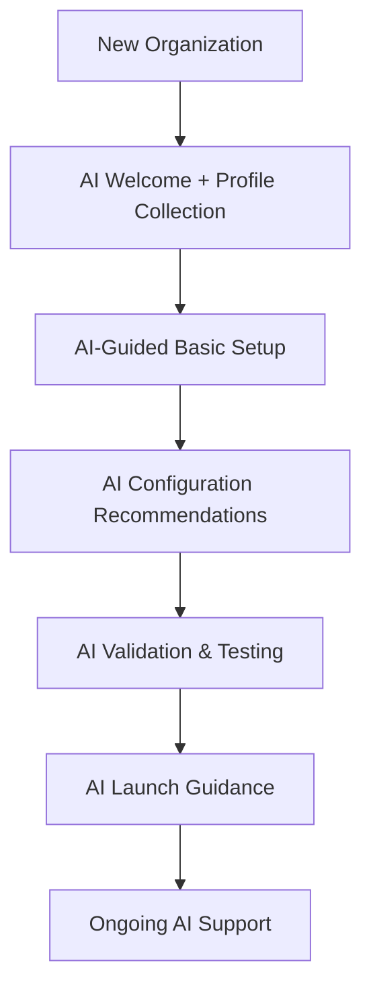

# Spec 018: AI Assistant System (ChurchAI)

## Feature Overview
**Feature Name:** AI Assistant System (ChurchAI)
**Epic:** AI & Intelligence
**Priority:** P1 (Post-MVP, High Value)
**Africa-First Considerations:** Multi-language support, cost-effective AI models, offline-capable AI assistance

## Vision Statement

Deploy an intelligent AI assistant for every organization that registers on ChMS, providing personalized guidance, analytics support, and operational assistance to help churches thrive with data-driven insights.

## Problem Statement

### Current Limitations
- **Manual Onboarding**: New church administrators struggle with system setup and best practices
- **Complex Analytics**: Non-technical users find it difficult to extract meaningful insights from church data
- **Support Burden**: High volume of basic support requests that could be automated
- **Knowledge Retention**: Institutional knowledge lost when staff changes
- **Decision Making**: Limited data-driven insights for ministry optimization

### Future Needs
- **Intelligent Assistance**: AI-powered guidance for all system operations
- **Natural Language Interaction**: Users should be able to ask questions in plain language
- **Personalized Insights**: Organization-specific recommendations based on data patterns
- **Automated Onboarding**: AI-guided setup process for new organizations
- **Demo Experience**: Interactive demo with realistic data for prospective customers

## Solution Overview

### AI Assistant Architecture
- **Organization-Specific AI**: Each church gets its own AI assistant with institutional knowledge
- **Multi-Modal Interface**: Chat, dashboard widgets, and guided setup workflows
- **Cost-Effective Models**: Strategic use of affordable AI models (GLM-4.5, Claude Haiku)
- **Privacy-First**: All data remains organization-scoped and secure
- **Africa-Optimized**: Multi-language support, low-bandwidth optimization

## Prototype Design Requirements (TweakCN Theme)

### AI Dashboard Design
**⚠️ CRITICAL**: The AI assistant system must implement the prototype's AI dashboard design:

#### AI Chat Interface
- **Chat Container**: Match prototype's chat interface design
  - Background: `oklch(0.1822 0 0)` (dark background)
  - Message bubbles: Card background `oklch(0.2046 0 0)`
  - AI responses: Primary green accent `oklch(0.4365 0.1044 156.7556)`
- **Input Field**: ModernInput component with OKLCH styling
- **Send Button**: Primary green button
- **Suggested Questions**: Card-based suggestions with hover states

#### AI Dashboard Widgets
- **Widget Cards**: 
  - Background: `oklch(0.2046 0 0)` (card background)
  - Border: `oklch(0.2809 0 0)` (border color)
  - Shadow: Use prototype's shadow system
- **Insight Cards**: Match prototype's card design
- **Chart Widgets**: Use ECharts with OKLCH chart colors
- **Quick Actions**: Primary green buttons

#### AI Insights Display
- **Insight Cards**: Card styling with OKLCH colors
- **Churn Predictions UI**: Match prototype's prediction display
- **Analytics Charts**: Use ECharts with OKLCH colors
- **Recommendation Cards**: Card design with action buttons

### Component Styling Requirements
- **Colors**: Use OKLCH color system throughout
- **Typography**: Geist font, light weights for headings
- **Spacing**: Match prototype's spacing system
- **Shadows**: Use prototype's shadow system
- **Border Radius**: `0.5rem` (8px) base radius

## Core Features

### Phase 1: Foundation (Months 4-5)

#### 1.1 Conversational AI Interface
- **Natural Language Chat**: Text-based conversation with AI assistant
- **Context Awareness**: Remembers conversation history and organization context
- **Multi-Language Support**: English, Yoruba, Hausa, Igbo initially
- **Organization Personality**: AI adapts to church size, denomination, and culture
- **Offline Support**: Basic AI assistance available without internet

**Implementation Components:**
```vue
<!-- Chat Interface -->
<AIChatInterface>
  <MessageList />
  <MessageInput
    placeholder="Ask me anything about your church..."
    @send="handleAIMessage"
  />
  <SuggestedQuestions />
</AIChatInterface>
```

#### 1.2 AI-Guided Onboarding
- **Interactive Setup Wizard**: AI guides through organization setup process
- **Best Practice Recommendations**: Suggests optimal configurations based on church profile
- **Contextual Help**: AI provides help tips during setup
- **Troubleshooting Assistance**: AI helps resolve setup issues
- **Progress Tracking**: Monitors setup completion and suggests next steps

**Setup Workflow:**


#### 1.3 Natural Language Analytics
- **"Ask AI" Widget**: Dashboard widget for natural language queries
- **Query Processing**: Understands church-specific questions and terminology
- **Data Visualization**: AI generates charts and visualizations based on queries
- **Insight Generation**: Provides actionable insights beyond raw data
- **Drill-Down Support**: Enables deeper exploration of analytics

**Sample Queries:**
- "What were our attendance trends last month?"
- "Which members need follow-up this week?"
- "How has our youth ministry grown this year?"
- "What's our average giving per member?"

### Phase 2: Intelligence (Months 6-7)

#### 2.1 Predictive Analytics
- **Attendance Forecasting**: Predict service attendance based on historical patterns
- **Engagement Risk Scoring**: Identify members at risk of disengagement
- **Giving Projections**: Forecast donation trends and patterns
- **Event Success Prediction**: Predict event attendance and engagement

#### 2.2 Personalized Recommendations
- **Ministry Optimization**: Suggest improvements for programs and ministries
- **Member Engagement**: Recommend personalized engagement strategies
- **Resource Allocation**: Suggest optimal resource distribution
- **Growth Opportunities**: Identify opportunities for church growth

#### 2.3 Advanced AI Features
- **Voice Interaction**: Voice-to-text and text-to-speech capabilities
- **Multi-Turn Conversations**: Complex, multi-step dialogues
- **Proactive Insights**: AI initiates conversations with important insights
- **Integration Extensions**: Connect with external church management tools

### Phase 3: Demo System (Month 8)

#### 3.1 Smart Demo Data Population
- **Preference Collection**: AI asks about church size, ministry focus, and interests
- **Realistic Data Generation**: Creates members, attendance patterns, and financial data
- **Scenario-Based Demos**: Different demo scenarios for different church types
- **Interactive Tutorial**: AI walks through features using generated demo data

#### 3.2 Demo-to-Production Transition
- **Seamless Migration**: Convert demo account to production with real data
- **Configuration Preservation**: Keep settings and preferences from demo
- **Data Import Tools**: Easy import of existing church data
- **AI-Assisted Migration**: AI helps with data cleanup and organization

## User Stories

### Church Administrator
- **As a** church administrator, **I want** an AI assistant to guide me through setup **so that** I can configure the system correctly and efficiently
- **As a** church administrator, **I want** to ask questions about my church data in plain language **so that** I can get insights without learning complex analytics
- **As a** church administrator, **I want** personalized recommendations for church growth **so that** I can make better ministry decisions

### Pastor
- **As a** pastor, **I want** AI insights into member engagement patterns **so that** I can provide better pastoral care
- **As a** pastor, **I want** predictive analytics for attendance and giving **so that** I can plan ministry activities effectively
- **As a** pastor, **I want** AI to help me identify members who need follow-up **so that** no one falls through the cracks

### Ministry Leader
- **As a** ministry leader, **I want** AI assistance with volunteer management **so that** I can prevent burnout and improve retention
- **As a** ministry leader, **I want** AI-powered insights into program effectiveness **so that** I can optimize ministry impact
- **As a** ministry leader, **I want** natural language access to ministry analytics **so that** I can make data-driven decisions

### New User (Demo Experience)
- **As a** prospective customer, **I want** to explore the system with realistic demo data **so that** I can understand how it would work for my church
- **As a** prospective customer, **I want** an AI guide to explain features **so that** I can quickly understand the value proposition
- **As a** prospective customer, **I want** a seamless transition from demo to production **so that** I can start using the system with my real data

## Technical Requirements

### Infrastructure Requirements

#### AI Service Architecture
```yaml
AI Assistant Service:
  - Docker containerization
  - 2GB RAM minimum (4GB recommended)
  - Multi-region deployment (US, EU, Africa)
  - Auto-scaling based on usage

AI Model Integration:
  - Primary: GLM-4.5 ($0.6/1M input, $2.2/1M output)
  - Secondary: Claude Haiku ($0.25/1M input, $1.25/1M output)
  - Local: Ollama + Llama 3.1 8B (offline support)

Memory & Storage:
  - Redis for session caching
  - PostgreSQL for conversation history
  - ChromaDB/Qdrant for vector storage
  - Local storage for offline capabilities
```

#### Database Schema Extensions
```sql
-- AI Conversations
CREATE TABLE ai_conversations (
    id BIGINT PRIMARY KEY,
    organization_id BIGINT NOT NULL,
    user_id BIGINT NOT NULL,
    title VARCHAR(255),
    created_at TIMESTAMP DEFAULT CURRENT_TIMESTAMP,
    updated_at TIMESTAMP DEFAULT CURRENT_TIMESTAMP ON UPDATE CURRENT_TIMESTAMP,
    FOREIGN KEY (organization_id) REFERENCES organizations(id),
    FOREIGN KEY (user_id) REFERENCES users(id)
);

-- AI Messages
CREATE TABLE ai_messages (
    id BIGINT PRIMARY KEY,
    conversation_id BIGINT NOT NULL,
    role ENUM('user', 'assistant', 'system') NOT NULL,
    content TEXT NOT NULL,
    metadata JSONB,
    created_at TIMESTAMP DEFAULT CURRENT_TIMESTAMP,
    FOREIGN KEY (conversation_id) REFERENCES ai_conversations(id)
);

-- AI Insights
CREATE TABLE ai_insights (
    id BIGINT PRIMARY KEY,
    organization_id BIGINT NOT NULL,
    insight_type VARCHAR(100) NOT NULL,
    title VARCHAR(255) NOT NULL,
    description TEXT,
    data JSONB,
    is_read BOOLEAN DEFAULT FALSE,
    created_at TIMESTAMP DEFAULT CURRENT_TIMESTAMP,
    FOREIGN KEY (organization_id) REFERENCES organizations(id)
);

-- AI Preferences
CREATE TABLE ai_preferences (
    id BIGINT PRIMARY KEY,
    organization_id BIGINT NOT NULL,
    preference_key VARCHAR(100) NOT NULL,
    preference_value TEXT,
    FOREIGN KEY (organization_id) REFERENCES organizations(id),
    UNIQUE KEY unique_org_preference (organization_id, preference_key)
);
```

### API Endpoints

#### AI Chat Endpoints
```yaml
POST /api/ai/chat:
  description: Send message to AI assistant
  parameters:
    - message: string (required)
    - conversation_id: string (optional)
  response:
    - message: string
    - conversation_id: string
    - suggestions: array
    - metadata: object

GET /api/ai/conversations:
  description: List user's AI conversations
  response:
    - conversations: array
    - pagination: object

POST /api/ai/conversations:
  description: Create new AI conversation
  parameters:
    - title: string (optional)
  response:
    - conversation_id: string
    - title: string
```

#### AI Analytics Endpoints
```yaml
POST /api/ai/query:
  description: Natural language analytics query
  parameters:
    - query: string (required)
    - visualization_type: string (optional)
  response:
    - answer: string
    - data: object
    - visualization: object
    - related_insights: array

GET /api/ai/insights:
  description: Get AI-generated insights
  parameters:
    - type: string (optional)
    - limit: integer (optional)
  response:
    - insights: array
    - unread_count: integer
```

#### AI Setup Endpoints
```yaml
POST /api/ai/setup-guide:
  description: Get AI guidance for setup
  parameters:
    - step: string (required)
    - context: object (optional)
  response:
    - guidance: string
    - suggestions: array
    - next_steps: array

POST /api/ai/preferences:
  description: Update AI preferences
  parameters:
    - preferences: object (required)
  response:
    - success: boolean
    - updated_preferences: object
```

### Frontend Components

#### Vue 3 Components
```vue
<!-- AI Chat Interface -->
<template>
  <div class="ai-chat-interface">
    <ChatHeader
      :title="conversationTitle"
      :status="connectionStatus"
    />
    <MessageList
      :messages="messages"
      :loading="isLoading"
      @message-action="handleMessageAction"
    />
    <MessageInput
      v-model="newMessage"
      :suggestions="suggestedQuestions"
      :disabled="isLoading"
      @send="sendMessage"
    />
  </div>
</template>

<!-- AI Analytics Widget -->
<template>
  <div class="ai-analytics-widget">
    <WidgetHeader title="Ask AI" />
    <QueryInput
      v-model="analyticsQuery"
      :placeholder="queryPlaceholder"
      @submit="executeQuery"
    />
    <QueryResults
      v-if="results"
      :answer="results.answer"
      :visualization="results.visualization"
      :insights="results.insights"
    />
    <SuggestedQueries
      :queries="suggestedQueries"
      @select="setQuery"
    />
  </div>
</template>

<!-- AI Setup Guide -->
<template>
  <div class="ai-setup-guide">
    <GuideProgress
      :current-step="currentStep"
      :total-steps="totalSteps"
    />
    <GuideContent
      :step="currentStep"
      :guidance="aiGuidance"
      :suggestions="suggestions"
    />
    <GuideActions
      :can-proceed="canProceed"
      @next="nextStep"
      @previous="previousStep"
      @ask-ai="askAI"
    />
  </div>
</template>
```

### Integration Points

#### Chat System Integration (Spec 014)
```yaml
Integration Features:
  - AI conversation channels in chat system
  - Real-time AI responses via WebSockets
  - Message history persistence
  - Role-based AI access controls

Technical Integration:
  - Extend existing chat components for AI messages
  - Add AI message type handling
  - Implement AI conversation management
  - Integrate with existing real-time infrastructure
```

#### AI Memory System Integration (Spec 015)
```yaml
Integration Features:
  - Organization knowledge base for AI context
  - Conversation history storage and retrieval
  - Pattern recognition for personalized responses
  - Long-term memory for organizational preferences

Technical Integration:
  - Use Mem0 for conversation context management
  - Store AI insights in organization memory
  - Leverage pattern recognition for recommendations
  - Implement memory-based personalization
```

#### Dashboard Integration (Spec 006)
```yaml
Integration Features:
  - "Ask AI" widget in dashboard
  - AI-powered insights cards
  - Natural language query processing
  - AI-generated visualizations

Technical Integration:
  - Add AI widget to dashboard layout
  - Implement query processing and visualization
  - Display AI insights alongside traditional metrics
  - Enable conversational analytics interactions
```

#### Organization Setup Integration (Spec 003)
```yaml
Integration Features:
  - AI-guided setup wizard
  - Contextual help tooltips
  - Best practice recommendations
  - Automated configuration suggestions

Technical Integration:
  - Add AI assistant to setup workflow
  - Implement contextual help system
  - Provide AI recommendations during setup
  - Enable AI troubleshooting assistance
```

## Performance Requirements

### Response Time Targets
```yaml
AI Chat Response: < 2 seconds
Analytics Query: < 3 seconds
Setup Guidance: < 1 second
Insight Generation: < 5 seconds
Offline Response: < 5 seconds (cached responses)
```

### Scalability Targets
```yaml
Concurrent Users: 1,000+ organizations
Message Throughput: 10,000+ messages/hour
Query Processing: 1,000+ queries/hour
Storage Growth: 1GB/month per organization
Uptime: 99.5% availability
```

### Cost Management
```yaml
Per-Organization Cost: <$5/month at scale
AI Model Budget: 30% of total infrastructure cost
Storage Optimization: Automatic cleanup of old conversations
Caching Strategy: Redis for frequent queries, local for offline
```

## Security & Privacy

### Data Protection
```yaml
Organization Isolation: Complete data separation between churches
Encryption: End-to-end encryption for AI conversations
Data Retention: Configurable retention policies (30-365 days)
Access Control: Role-based access to AI features
Audit Logging: Complete audit trail of AI interactions
```

### AI Security
```yaml
Prompt Injection Prevention: Input validation and sanitization
Content Filtering: Prevent inappropriate or harmful AI responses
Rate Limiting: Prevent abuse of AI features
Model Security: Secure API key management and rotation
Privacy Compliance: GDPR-compliant data handling
```

### Content Safety
```yaml
Response Filtering: Remove inappropriate content
Bias Mitigation: Regular bias testing and mitigation
Transparency: Clear indication of AI-generated content
Human Oversight: Ability to flag and review AI responses
Ethical Guidelines: Church-appropriate AI behavior guidelines
```

## Implementation Strategy

### Phase 1: Foundation (Months 4-5)
```yaml
Month 4: Core AI Infrastructure
  - AI assistant service setup
  - Basic chat interface implementation
  - Integration with chat system (Spec 014)
  - Natural language processing pipeline

Month 5: Guided Onboarding
  - AI setup wizard implementation
  - Integration with organization setup (Spec 003)
  - Basic analytics query processing
  - Context management and memory integration
```

### Phase 2: Intelligence (Months 6-7)
```yaml
Month 6: Advanced Analytics
  - Natural language analytics queries
  - Dashboard integration (Spec 006)
  - Insight generation algorithms
  - Visualization components

Month 7: Personalization & Optimization
  - Organization-specific AI personalities
  - Predictive analytics capabilities
  - Multi-language support
  - Performance optimization
```

### Phase 3: Demo System (Month 8)
```yaml
Demo Data Generation:
  - Preference collection interface
  - Realistic data generation algorithms
  - Interactive demo experience
  - Demo-to-production transition tools
```

## Success Metrics

### User Engagement Metrics
```yaml
AI Adoption Rate: >70% of organizations use AI features within 30 days
Query Volume: >10 AI queries per organization per week
Setup Completion: AI-guided setup completion rate >90%
User Satisfaction: AI assistant satisfaction rating >4.0/5.0
```

### Performance Metrics
```yaml
Response Time: <2 seconds for 95% of AI responses
System Uptime: >99.5% availability
Cost Efficiency: <$5 per organization per month
Query Success Rate: >95% of queries receive helpful responses
```

### Business Impact Metrics
```yaml
Support Reduction: 40% reduction in basic support requests
Onboarding Time: 50% reduction in setup time
Data-Driven Decisions: 60% of organizations report better decisions
User Retention: 15% improvement in user retention
```

## Risk Mitigation

### Technical Risks
```yaml
AI Model Costs: Implement cost monitoring and optimization
Response Quality: Continuous evaluation and model fine-tuning
Scalability Issues: Horizontal scaling architecture
Integration Complexity: Phased rollout with extensive testing
Performance Bottlenecks: Caching and optimization strategies
```

### Business Risks
```yaml
User Adoption: Comprehensive onboarding and training
Privacy Concerns: Transparent data handling and privacy controls
Compliance Issues: Regular legal and compliance reviews
Competition: Continuous feature innovation and differentiation
Cost Overruns: Strict budget management and cost monitoring
```

### Ethical Risks
```yaml
AI Bias: Regular bias testing and mitigation
Dependency Risk: Maintain human oversight and control
Transparency: Clear AI capabilities and limitations disclosure
Accountability: Clear responsibility for AI-generated content
Cultural Sensitivity: Africa-first approach and cultural adaptation
```

## Future Enhancements

### Advanced AI Capabilities
```yaml
Voice Interaction: Voice-to-text and text-to-speech
Computer Vision: Document scanning and OCR integration
Predictive Modeling: Advanced forecasting algorithms
Multi-Modal AI: Image, video, and audio processing
Custom AI Models: Organization-specific fine-tuned models
```

### Integration Expansions
```yaml
Third-Party Tools: Integration with external church software
Mobile Apps: Native AI assistant mobile applications
API Ecosystem: Public APIs for custom AI integrations
IoT Integration: Smart church device integration
Social Media: Social media analytics and engagement
```

### Advanced Features
```yaml
Workflow Automation: AI-powered workflow automation
Decision Support: Advanced decision-making support systems
Knowledge Management: Comprehensive church knowledge base
Collaboration AI: AI-facilitated team collaboration
Strategic Planning: AI-assisted strategic planning tools
```

## Dependencies

### Technical Dependencies
```yaml
Spec 014: Chat System - Communication infrastructure
Spec 015: AI Memory System - Memory and knowledge management
Spec 006: Dashboard System - Analytics and visualization foundation
Spec 003: Organization Setup - Onboarding and configuration
Laravel Backend: API integration and business logic
Vue 3 Frontend: User interface and interactions
PostgreSQL: Data persistence and management
Redis: Caching and session management
```

### External Dependencies
```yaml
AI Model Providers: GLM-4.5, Claude Haiku, OpenAI
Vector Database: ChromaDB, Qdrant, or pgvector
Cloud Infrastructure: Docker, Kubernetes, multi-region deployment
Monitoring: AI performance and cost monitoring
Security: SSL certificates, API security, compliance tools
```

## Documentation Requirements

### Technical Documentation
```yaml
API Documentation: Complete API reference and examples
Architecture Documentation: System design and integration patterns
Deployment Guide: Step-by-step deployment instructions
Monitoring Guide: Performance monitoring and troubleshooting
Security Guide: Security best practices and compliance
```

### User Documentation
```yaml
AI Assistant Guide: User manual for AI features
Setup Guide: Step-by-step onboarding instructions
Query Guide: Examples and best practices for AI queries
Troubleshooting Guide: Common issues and solutions
Privacy Guide: Data handling and privacy information
```

---

**Note:** This specification establishes ChMS as the first AI-powered church management system in the African market, providing significant competitive advantage while maintaining cost-effectiveness and privacy-first principles. Implementation will be phased to ensure stability, user adoption, and sustainable growth.