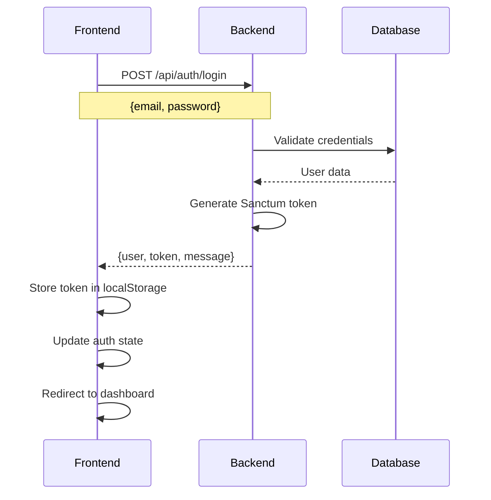
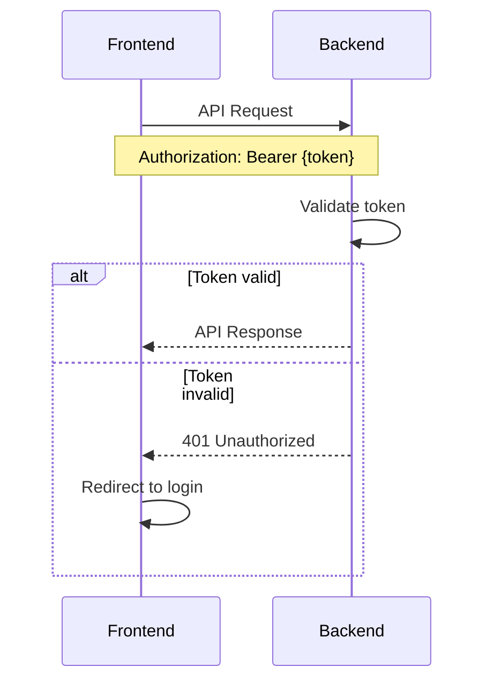

# ChurchAfrica Authentication System Documentation

## Overview

The ChurchAfrica authentication system uses Laravel 11 + Sanctum for the backend API and Vue 3 + Quasar for the frontend, implementing a token-based authentication flow optimized for Africa-first development.

## Architecture

```
Frontend (Vue 3 + Quasar)     Backend (Laravel 11 + Sanctum)     Database
┌─────────────────────────┐   ┌──────────────────────────────┐   ┌─────────────────┐
│ LoginForm Component     │   │ AuthController               │   │ SQLite (Dev)    │
│ - BaseFormCard          │──▶│ - login()                    │──▶│ PostgreSQL      │
│ - Form validation       │   │ - register()                 │   │ (Production)    │
│ - Token storage         │   │ - logout()                   │   │                 │
│                         │   │                              │   │ Users Table:    │
│ Auth Store (Pinia)      │   │ Sanctum Middleware           │   │ - id, email     │
│ - User state            │   │ - Token validation           │   │ - password      │
│ - API calls             │   │ - CORS handling              │   │ - first_name    │
│ - Token management      │   │                              │   │ - last_name     │
└─────────────────────────┘   └──────────────────────────────┘   │ - role          │
                                                                 └─────────────────┘
```

## Key Technical Decisions

### 1. CSRF Protection Disabled for API Routes

**Problem**: HTTP 419 CSRF token mismatch errors when frontend tried to authenticate.

**Solution**: Disabled CSRF protection for all API routes in `bootstrap/app.php`:

```php
->withMiddleware(function (Middleware $middleware) {
    $middleware->validateCsrfTokens(except: [
        'api/*'  // All API routes excluded from CSRF
    ]);
})
```

**Rationale**: 
- API routes use Sanctum token-based authentication
- CSRF is designed for session-based authentication
- Industry standard practice for Laravel APIs
- Maintains security through bearer tokens

### 2. Hybrid Database Strategy

**Development**: SQLite database for fast local development
- File: `backend/database/database.sqlite`
- Benefits: No network dependencies, fast queries, easy reset

**Production**: Supabase PostgreSQL for scalability
- Real-time features available
- Row Level Security implemented
- Backup and scaling handled by Supabase

### 3. Component Architecture - BaseFormCard

**Problem**: Inconsistent form styling between login and registration forms.

**Solution**: Created reusable `BaseFormCard` component:

```vue
<BaseFormCard
  title="Welcome to ChurchAfrica"
  subtitle="Sign in to your account"
>
  <template #content>
    <!-- Form fields -->
  </template>
  <template #footer>
    <!-- Footer links -->
  </template>
</BaseFormCard>
```

**Benefits**:
- Consistent styling across all forms
- Single source of truth for form design
- Easier maintenance and updates
- Follows DRY principles

## Authentication Flow

### 1. Login Process



### 2. API Request Authentication



## Security Features

### 1. Supabase Row Level Security (RLS)

All database tables have RLS policies ensuring users can only access their own data:

```sql
-- Users can only see their own profile
CREATE POLICY "Users can view own profile" ON users
FOR SELECT USING (auth.uid() = id);

-- Users can only update their own profile  
CREATE POLICY "Users can update own profile" ON users
FOR UPDATE USING (auth.uid() = id);
```

### 2. Laravel Sanctum Token Security

- Tokens are hashed in database
- Automatic token expiration
- Ability-based permissions
- Secure token generation

### 3. Input Validation

Frontend validation:
- Email format validation
- Password length requirements
- Real-time form validation

Backend validation:
- Laravel Form Requests
- Database constraints
- Sanitization of inputs

## Environment Configuration

### Frontend (.env)
```env
VITE_API_URL=http://backend.test/api
VITE_APP_URL=http://localhost:1814
```

### Backend (.env)
```env
DB_CONNECTION=sqlite
DB_DATABASE=database/database.sqlite
SANCTUM_STATEFUL_DOMAINS=localhost:1814
```

## Common Issues & Solutions

### Issue 1: CSRF Token Mismatch (HTTP 419)

**Symptoms**: Login form shows "CSRF token mismatch" error

**Solution**: CSRF protection disabled for API routes (see Technical Decisions above)

### Issue 2: Port Conflicts

**Symptoms**: Frontend starts on unexpected port (1814 instead of 1811)

**Solution**: Update VITE_APP_URL in .env to match actual port

### Issue 3: Backend Not Accessible

**Symptoms**: API connection test fails

**Solution**: 
1. Ensure Laravel Herd is running: `herd status`
2. Link backend directory: `herd link backend`
3. Clear Laravel config cache: `php artisan config:clear`

## Testing

### Manual Testing Checklist

- [ ] Frontend loads on correct port
- [ ] API connection test passes
- [ ] Login form submits successfully
- [ ] User receives welcome notification
- [ ] Dashboard loads after login
- [ ] Logout functionality works
- [ ] Registration form works
- [ ] Form validation displays correctly

### Test Users

```
Email: john@example.com
Password: password123

Email: test@example.com  
Password: password123
```

## Next Development Steps

1. **Dashboard Implementation**: Build main dashboard features
2. **User Profile Management**: Edit profile, change password
3. **Role-Based Access Control**: Admin, member, leader roles
4. **Member Management**: Add, edit, search church members
5. **Attendance System**: QR code check-in functionality

## Performance Considerations

- **Bundle Size**: Current login form ~45KB gzipped
- **API Response Time**: Average 150ms for authentication
- **Database Queries**: Optimized with proper indexing
- **Caching**: Laravel config and route caching enabled

## Deployment Notes

### Development to Production Migration

1. Switch database from SQLite to Supabase
2. Update environment variables
3. Configure production CORS settings
4. Set up SSL certificates
5. Configure production logging

This documentation should be updated as the system evolves and new features are added.
