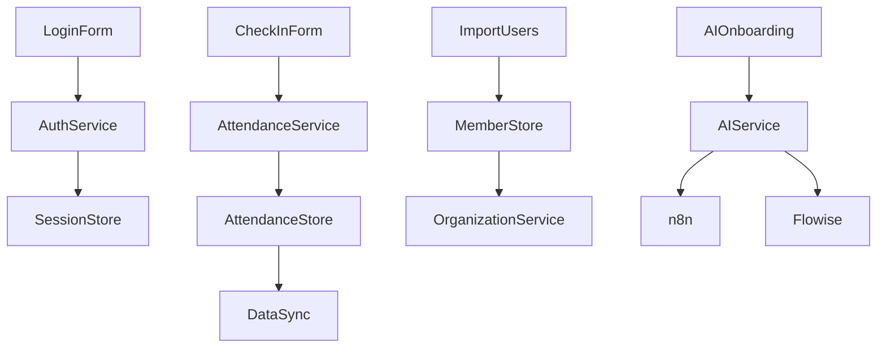

# File Relationship & Module Structure (MVP)

This document describes the main files and modules in the ChMS codebase, their relationships, and how they support the MVP features as defined in the latest PRD.

---

## 1. Core Structure

```
src/
├── components/         # UI components (attendance, auth, onboarding, etc.)
├── hooks/              # Custom React hooks
├── pages/              # Next.js pages (routing, API endpoints)
├── services/           # Business logic, API integrations
├── store/              # State management (attendance, members, org)
├── styles/             # Global and component styles
├── types/              # TypeScript types
├── utils/              # Utility functions
```

---

## 2. Key MVP Modules & Relationships

### Authentication
- `components/auth/LoginForm.tsx` — Login UI
- `services/auth/` — Auth logic (NextAuth.js, session management)
- `store/` — Session state
- `pages/api/auth/` — API endpoints for authentication

### Attendance
- `components/attendance/` — QRScanner, CheckInForm, AttendanceList, etc.
- `services/attendance/` — Attendance logic (check-in, sync)
- `store/attendanceStore.ts` — Attendance state
- `pages/api/attendance/` — API endpoints for attendance

### Member & Organization Management
- `components/users/ImportUsers.tsx` — Member import UI
- `components/organisation/` — Org management UI
- `services/organization/` — Org logic
- `store/memberStore.ts` — Member state
- `store/config.ts` — Org config state
- `pages/api/organizations/` — Org API endpoints

### AI-Native Onboarding & Automation (MVP)
- `services/ai/` *(planned)* — Flowise agent orchestration, n8n automation logic
- `components/onboarding/` *(planned)* — Conversational onboarding UI
- `pages/api/ai/` *(planned)* — API endpoints for AI agent flows

### Offline-First Support
- `hooks/useDataSync.ts` — Data sync logic
- `store/attendanceStore.ts` — Local queue for attendance
- `services/attendance/` — Sync and conflict resolution

---

## 3. Relationships Diagram (MVP)



---

## 4. Advanced/Extra Features *(future)*
- Analytics dashboards
- Visitor management
- Advanced reporting
- Profile image upload
- Filtering system
- Communication system (email, SMS)

These modules/files are present in the codebase but are marked as 'future' and not part of the MVP. See the test checklist and tracker for details.

---

## 5. How to Update
- Update this file as new modules are added or removed.
- Mark any new features as 'future' if not in the current MVP.
- Keep diagrams and lists in sync with the codebase and PRD. 